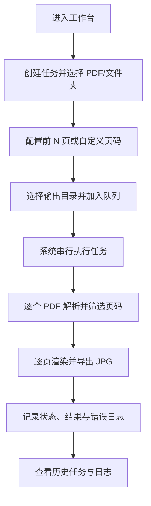

## 1. 产品概述

小红书素材工厂是一款完全本地执行的桌面应用，用于将 PDF 文档批量转换为适合小红书发布的图片素材，并支持根据商品资料文件夹结构自动生成资料列表展示图。产品聚焦“一个任务对应一个商品”的批处理场景，帮助运营、内容团队和电商团队把商品资料、说明书、卖点文档快速转换为可直接使用的图片，同时替代人工打开网盘截图制作资料列表详情图的流程。

### 1.1 产品定位

- 产品形态：本地桌面应用，不依赖远程服务端。
- 核心能力：
  - 批量读取 PDF/Word，按页码规则导出固定规格图片。
  - 读取商品资料文件夹真实目录结构，自动生成白底资料列表展示图。
- 处理方式：任务队列串行执行，单个任务失败不阻塞后续任务。
- 输出目标：
  - PDF/Word 转图：生成 `3:4` 竖版、`300 DPI`、`JPG 质量 100%` 的图片素材。
  - 资料列表展示图：生成 `1242×1656` px（3:4）、白底、`JPG 质量 100%` 的文件列表图片。

### 1.2 目标用户

| 角色 | 典型场景 | 核心诉求 |
|------|----------|----------|
| 电商运营 | 批量处理商品 PDF 资料 | 快速出图、统一规格、减少手工截图 |
| 内容运营 | 将资料转成发布素材 | 稳定导出、批量执行、可追溯日志 |
| 品牌/市场团队 | 归档和复用商品内容 | 按商品组织输出、失败可定位、支持重复执行 |

### 1.3 MVP 目标

- 支持单个 PDF、多个 PDF、文件夹内多个 PDF 三种输入方式。
- 支持“前 N 页”和“自定义页码/页码范围”两类导出规则。
- 支持多任务排队执行，并自动串行处理。
- 支持最近任务、执行状态、错误日志的本地保存与查看。
- 支持读取商品资料文件夹结构，自动生成白底资料列表展示图，替代人工网盘截图流程。

### 1.4 非目标

- 不支持在工作台中直接编辑 Word 文档内容（Word 仅作为输入走转换中转）。
- 不支持 OCR、摘要、智能排版、模板编辑。
- 不支持云同步、账号体系、在线协作。
- 不支持多尺寸导出与并发任务执行（仍按串行队列处理）。
- 不支持百度网盘真实截图、Finder 完整 UI 模拟、文件打开效果与动态交互。
- 不支持资料列表展示图的自定义模板编辑器（V1.2.0 仅提供白底固定样式）。

## 2. 核心业务规则

### 2.1 任务模型

- 一个任务对应一个商品目录或一个商品处理单元。
- 一个任务可包含：
  - 单个 PDF
  - 多个 PDF
  - 一个自动扫描 PDF 的文件夹
- 任务按加入顺序进入队列，并由系统自动串行执行。

### 2.2 导出规则

- 首版固定采用“PDF 1 页转 1 张图”。
- 导出图片固定为 JPG，质量 100%。
- 导出图片固定为 3:4 竖版。
- 目标输出精度为 300 DPI。
- 页面内容采用等比缩放并居中放置，空白区域以背景补边，避免裁切正文。

### 2.3 页码规则

- 支持输入“前 N 页”。
- 支持输入自定义页码与页码范围，例如：
  - `1,3,8`
  - `2-5`
  - `1,3-6,9`
- 当同时设置“前 N 页”和“自定义页码”时，系统合并后去重并按升序执行。
- 非法页码或超范围页码不参与导出，并记录警告日志。
- 若最终无合法页码，则当前 PDF 记为失败或跳过，并保留错误原因。

### 2.4 输出组织规则

- 用户先选择一个根输出目录。
- 每个任务输出到独立目录：`输出根目录/任务名/`
- 当任务包含多个 PDF 时，再按 PDF 文件名分组：`输出根目录/任务名/PDF文件名/`
- 图片命名统一采用：`{pdfBaseName}_p{页码三位}.jpg`

## 3. 用户流程

用户在工作台创建任务后，选择 PDF 文件或商品文件夹，设置页码规则和输出目录，将任务加入队列。系统按照顺序执行每个任务，逐个 PDF 逐页导出图片，并在执行过程中记录日志、展示状态与失败信息。全部任务结束后，用户可在历史记录和日志页中查看结果。

## 4. 功能需求

### 4.1 工作台

| 模块 | 功能描述 |
|------|----------|
| 任务创建区 | 新建任务，填写任务名，选择输入来源 |
| 文件选择区 | 支持选择单文件、多文件、文件夹 |
| 页码规则区 | 配置前 N 页、自定义页码与校验提示 |
| 输出设置区 | 选择根输出目录并展示固定导出规格 |
| 队列列表区 | 展示任务顺序、状态、进度、失败数量 |
| 执行控制区 | 启动队列、查看当前执行任务、执行完成提示 |

### 4.2 历史任务

| 模块 | 功能描述 |
|------|----------|
| 最近任务列表 | 展示最近执行任务、时间、状态、输出目录 |
| 结果摘要 | 展示 PDF 数、页数、成功页数、失败页数 |
| 重新执行入口 | 允许基于历史配置快速再次执行 |

### 4.3 日志查看

| 模块 | 功能描述 |
|------|----------|
| 应用日志 | 记录应用级运行信息与异常 |
| 任务日志 | 记录任务开始、结束、失败摘要 |
| 页级日志 | 记录具体 PDF 页码的成功与失败信息 |

### 4.4 资料列表展示图生成器（V1.2.0 新增）

| 模块 | 功能描述 |
|------|----------|
| 任务创建区 | 新建资料列表任务，填写任务名，选择一个或多个商品文件夹 |
| 队列管理区 | 展示资料列表任务队列、状态、商品数、操作 |
| 执行控制区 | 启动队列、查看当前执行任务与当前商品进度 |
| 目录扫描 | 递归扫描商品文件夹，自动过滤系统文件，返回真实目录树 |
| 图片渲染 | 基于白底 Canvas 渲染当前目录的直接子项（文件夹优先 + 文件名 + 文件类型图标） |
| 多级递归 | 每个非空目录独立生成图片，单目录超项自动分页 |
| 统一编号 | 单商品范围内图片全局递增编号输出到商品根目录 |

#### 4.4.1 功能背景

电子资料商品销售过程中，消费者无法直接确认卖家拥有完整资料。当前人工制作商品详情图时，需要打开百度网盘、进入商品资料目录、查看文件列表、截取文件列表截图、调整尺寸、放入商品详情图。该图片主要用于展示商品包含的全部资料、增强消费者真实性认知、提高购买信任。人工流程存在重复操作、多商品处理效率低、截图尺寸不统一、子文件夹需要人工逐个展开截图等问题。

#### 4.4.2 核心业务规则

- **商品根目录不展示**：商品文件夹作为扫描入口，生成的图片不展示商品文件夹名称本身，仅展示其直接子项。
- **当前目录展示规则**：每张图片只展示当前目录的直接子项（当前目录文件 + 当前目录文件夹），不包含子文件夹内部文件。
- **子文件夹独立生成**：所有子文件夹自动生成独立图片，按深度优先顺序递归处理。
- **文件夹优先排序**：同一目录下文件夹排列在前，文件排列在后；同类内部按名称升序（不区分大小写）。
- **文件类型图标**：PDF 显示 PDF 图标，Word（.docx/.doc）显示 Word 图标，Excel（.xlsx/.xls）显示 Excel 图标，PPT（.pptx/.ppt）显示 PPT 图标，文件夹显示文件夹图标，未识别后缀显示通用文件图标。

#### 4.4.3 图片生成规范

- 默认尺寸：`1242 × 1656` px（3:4）。
- 背景：纯白色。
- 元素：文件类型图标 + 文件名称，垂直排列。
- 不包含：商品名称、文件总数量、营销文案、水印、Logo。
- 自动分页：当当前目录内容超过单张图片承载范围（默认 25 项）时自动拆分为多张。

#### 4.4.4 输出规则

- 所有图片以 `资料列表_01.jpg`、`资料列表_02.jpg`、… 形式保存到商品根目录。
- 编号在商品范围内全局递增、两位零填充；若图片总数 ≥ 99，编号自动升级为三位零填充（如 `资料列表_100.jpg`）。
- 与商品根目录下已有的 `主图/`、`详情图/`、`笔记图1/` 等子目录并存，不破坏已有结构。
- 若同名文件已存在则直接覆盖。

#### 4.4.5 异常处理

- 空文件夹：不生成图片，写入 warn 日志，继续执行。
- 系统文件（`.DS_Store`、`Thumbs.db`、`desktop.ini`、`__MACOSX` 等）：自动忽略。
- 文件读取失败：跳过异常文件，记录日志，继续生成。
- 单目录渲染失败：跳过该目录，记录 error 日志，不影响统一编号连续性（跳过编号不复用）。
- 单商品失败：记录失败原因并标记为失败，继续处理队列中下一个商品。

#### 4.4.6 MVP 限制

V1.2.0 不开发：
- 百度网盘真实截图
- Finder 完整 UI 模拟
- 文件打开效果
- 动态交互
- 用户自定义模板编辑器

## 5. 页面说明

| 页面名称 | 主要内容 | 目标 |
|----------|----------|------|
| 工作台 | 任务创建、队列管理、执行监控 | 完成 PDF/Word 转图任务配置与启动 |
| 资料列表页 | 商品文件夹选择、队列管理、执行监控 | 完成资料列表展示图生成 |
| 历史任务页 | 最近任务、结果摘要、输出目录 | 快速查看历史记录 |
| 日志页 | 应用日志、任务日志、错误详情 | 定位失败原因 |

## 6. 状态与反馈

### 6.1 任务状态

- `pending`：已创建，等待执行。
- `running`：正在执行。
- `paused`：执行已被用户暂停，等待继续。
- `completed`：全部页导出成功。
- `completed_with_errors`：任务完成，但部分页或部分 PDF 失败。
- `failed`：任务无法继续执行，例如输出目录不可写。
- `cancelled`：用户取消执行，已导出文件保留不回滚。

状态迁移规则：

- `running` 可迁移到 `paused`、`cancelled`、`completed`、`completed_with_errors`、`failed`，不允许直接回 `pending`。
- `paused` 可迁移到 `running`（继续）或 `cancelled`，不允许直接迁移到终态。
- `cancelled`、`completed`、`completed_with_errors`、`failed` 视为终态，不再迁移。

### 6.2 用户反馈要求

- 创建任务时即时提示非法输入。
- 执行中展示当前任务、当前 PDF、当前页进度。
- 任务结束后展示成功数、失败数与输出路径。
- 出现错误时可追踪到任务、PDF、页码和错误原因。

## 7. 异常场景

| 场景 | 系统处理 |
|------|----------|
| 选择的文件不存在或已移动 | 当前任务失败并写入日志，队列继续 |
| 文件夹内没有 PDF 或 Word | 阻止开始执行并提示用户 |
| PDF 解析失败 | 当前 PDF 失败，继续同任务其他 PDF |
| 单页渲染失败 | 记录页级失败，继续下一页 |
| 输出目录不可写 | 当前任务失败，继续下一任务 |
| 所有页码均非法 | 当前 PDF 跳过或失败，并记录错误 |
| LibreOffice 未安装但任务含 Word | 阻止任务开始并显式提示，纯 PDF 任务不受影响 |
| Word 转 PDF 失败或超时 | 该 Word 视为失败 PDF 工作项并记录原因，继续同任务其他文件 |
| 任务执行中应用意外退出 | 启动时检测未完成任务，由用户确认继续或放弃恢复 |
| 用户在执行中暂停 | 任务在当前页或 PDF 边界切换为 `paused`，已完成结果保留 |
| 用户在执行中取消 | 任务切换为 `cancelled`，已导出文件保留不回滚 |

## 8. 验收标准

- 用户可在桌面应用中创建多个任务并加入队列。
- 每个任务可接受单个 PDF、多个 PDF、一个包含多个 PDF 的文件夹，或 Word（.docx/.doc）与 PDF 混合输入。
- 用户可在执行前配置前 N 页、自定义页码或混合规则。
- 队列可自动按顺序执行，无需逐个手动启动。
- 任一页、任一 PDF、任一任务失败都不会阻塞后续队列。
- 所有导出结果均为固定 3:4 竖版 JPG，目标 300 DPI，质量 100%。
- 用户可对运行中任务执行暂停、继续、取消，并按状态控制按钮可用性。
- 应用重启后可检测未完成任务，并提供“继续 / 放弃”恢复入口。
- 用户可查看最近任务、结果摘要和错误日志。
- 资料列表生成器：输入商品目录后自动生成列表图片，文件名称与真实目录一致，子文件夹独立生成图片，支持批量商品处理。
- 资料列表图片：白色背景、文件图标正确、文件名称完整显示、无额外营销文字、图片尺寸符合 1242×1656。
- 资料列表稳定性：单商品失败不影响批处理，错误写入日志，输出目录结构正确。

## 9. 版本规划

### 9.1 当前版本

- 完成本地桌面任务工作台。
- 完成 PDF 页转图与批量导出。
- 完成日志与最近任务持久化。
- 支持 Word（.docx/.doc）输入：通过 LibreOffice 无头模式转换为 PDF 后复用 v1.0 导出链路。
- 支持任务运行时控制：暂停、继续、取消，控制信号在页级或 PDF 级边界生效。
- 支持 PDF 级断点恢复：任务执行中每个 PDF 完成后写入断点，应用重启后可在工作台选择“继续 / 放弃”恢复。
- 支持资料列表展示图生成器：读取商品资料文件夹真实目录结构，自动生成白底 1242×1656 文件列表图片，支持多级目录递归与批量商品处理。

### 9.2 后续可扩展方向

- 支持更多输出尺寸和命名策略（如多尺寸同时导出、自定义命名模板）。
- 支持页级断点恢复（当前仅 PDF 级断点，未完成 PDF 会从起始页重新处理）。
- 支持更完整的任务恢复能力（如自动恢复而非用户确认）。
- 支持 OCR、摘要、智能排版等增值能力。
- 资料列表展示图模板扩展（V1.30）：简洁模式、云盘模式、Finder 模式。
- 资料列表展示图智能化（V2）：用户自定义展示模板、AI 优化展示顺序、自动选择最佳展示图片数量。
