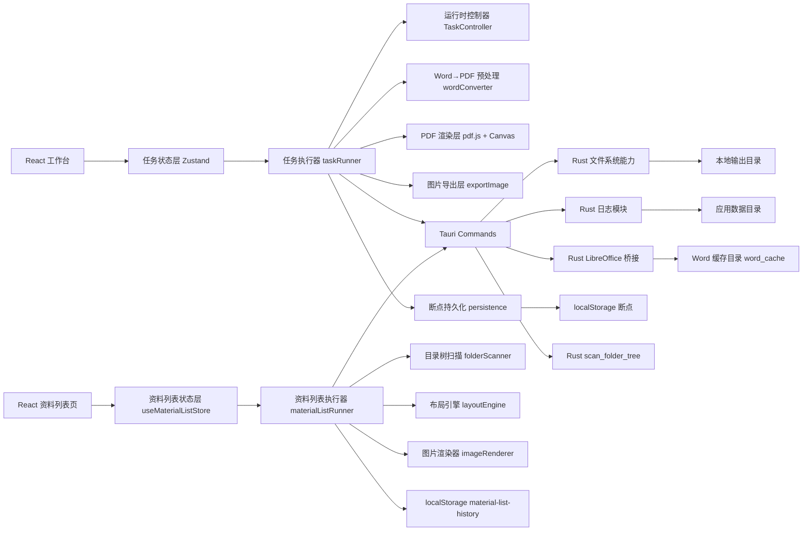
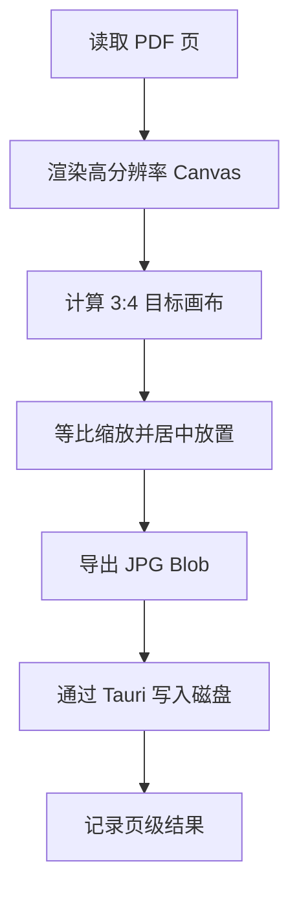
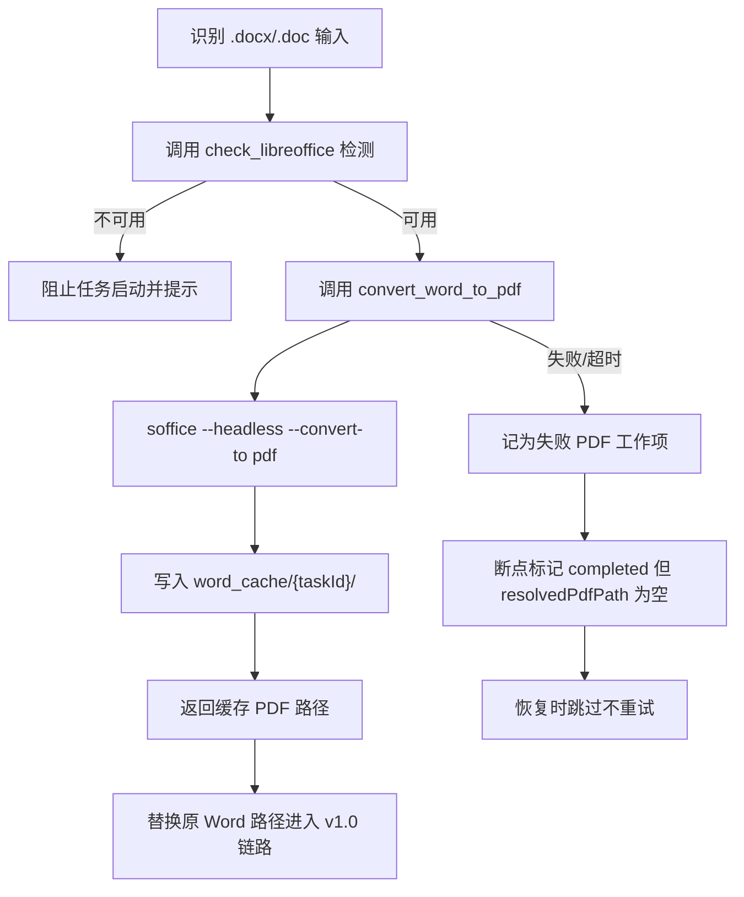
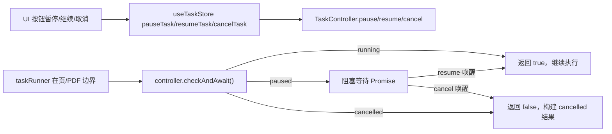
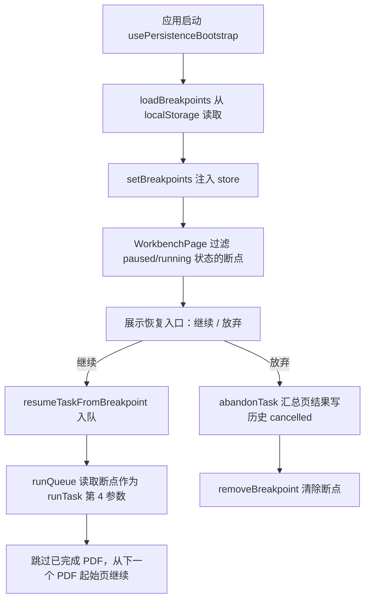
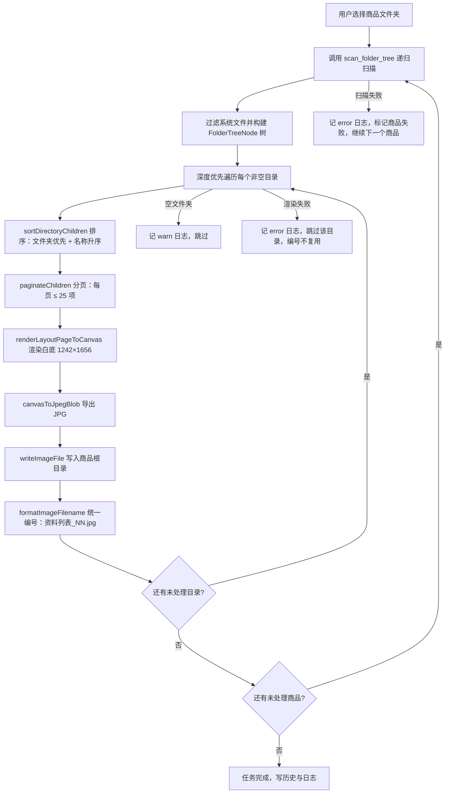

## 1. 架构目标

本文档基于当前实施计划，定义“小红书素材工厂”的本地桌面技术架构（当前版本 v1.2.0）。系统不再采用前后端分离的服务式方案，而是调整为完全本地执行的桌面应用，重点保证批处理稳定性、导出正确性、日志可追踪性、运行时可控性、断点可恢复性和后续扩展性。v1.2.0 在 v1.1.0 PDF/Word 转图链路基础上，新增资料列表展示图生成器能力，与既有 PDF 任务流水线并存且互不干扰。

### 1.1 架构原则

- 完全本地执行，不依赖远程 API、服务端数据库或对象存储。
- 前端负责任务编排、状态展示、PDF 页渲染、资料列表渲染与运行时控制信号。
- Rust 侧负责文件系统访问、目录创建、日志落盘、LibreOffice 桥接、目录树递归扫描和桌面能力桥接。
- 任务执行采用串行队列，优先保证稳定性与可恢复的执行结果。
- 功能边界围绕“PDF 按页转图”与“资料文件夹结构转列表图”两条独立链路构建；Word 输入通过 LibreOffice 转换为 PDF 后复用 PDF 链路。
- 运行时控制通过注入式 `TaskController` 在页级/PDF 级边界检查信号，不破坏 v1.0 执行链路。
- 断点恢复以 PDF 为粒度，断点独立于任务结果摘要，便于应用重启后快速读取。
- 资料列表生成器为独立任务模型与执行器，复用 v1.0/v1.1 的 `ensure_output_dir`、`write_image_file`、`append_log_line` 基础能力，但不复用 PDF 任务的状态机与断点逻辑。

## 2. 总体架构



### 2.1 分层说明

| 层级 | 责任 |
|------|------|
| 前端界面层 | 提供工作台、资料列表页、历史任务页、日志查看页，含运行时控制按钮与恢复入口 |
| 前端状态层 | 保存 PDF 任务队列、资料列表任务队列、执行状态、最近任务、错误摘要、断点表、当前控制器引用 |
| 前端领域层 | 页码解析、任务调度、PDF 渲染、图片合成、运行时信号、断点读写、资料列表目录扫描与 Canvas 渲染 |
| Tauri 桥接层 | 暴露文件选择、路径处理、写文件、写日志、LibreOffice 检测与转换、目录树递归扫描等命令 |
| Rust 能力层 | 处理文件系统操作、日志落盘、应用目录管理、调用 LibreOffice 无头模式、递归扫描目录树并过滤系统文件 |

## 3. 技术选型

| 分类 | 方案 | 选型原因 |
|------|------|----------|
| 桌面容器 | `Tauri v2` | 体积轻、可调用本地能力、适合本地工具 |
| 前端框架 | `React + TypeScript + Vite` | 开发效率高，适合复杂工作台交互 |
| 样式 | `Tailwind CSS` | 便于快速搭建桌面工作台 UI |
| 状态管理 | `Zustand` | 轻量，适合任务队列、执行状态、断点表与控制器引用管理 |
| 表单校验 | `React Hook Form + Zod` | 页码规则和任务配置的输入校验清晰 |
| PDF 能力 | `pdf.js` | 可读取页数并逐页渲染到 Canvas |
| 图片导出 | 浏览器 `Canvas` + 本地文件写入 | 便于控制缩放、画布比例和 JPG 输出 |
| Word 转 PDF | LibreOffice 无头模式 (`soffice --headless --convert-to pdf`) | 跨平台、支持 .docx/.doc、无需付费组件 |
| 本地持久化 | localStorage（历史 + 断点）+ Rust 文件日志 | 满足最近任务、断点与日志持久化需求 |

## 4. 模块划分

### 4.1 前端模块

| 模块 | 说明 |
|------|------|
| `WorkbenchPage` | 新建任务、配置规则、启动队列 |
| `MaterialListPage` | v1.2.0 新增：资料列表任务创建、商品文件夹选择、队列与进度 |
| `HistoryPage` | 查看最近任务与结果摘要 |
| `LogViewerPage` | 查看应用日志与任务日志 |
| `TaskForm` | 输入任务名、来源、输出目录 |
| `PageRuleInput` | 输入前 N 页和自定义页码 |
| `TaskQueueTable` | 展示任务顺序、状态、进度、失败数 |
| `TaskProgressPanel` | 展示当前任务、当前 PDF、当前页 |
| `MaterialListTaskForm` | v1.2.0 新增：资料列表任务名输入、商品文件夹多选、加入队列 |
| `MaterialListQueueTable` | v1.2.0 新增：资料列表队列表格（任务名、商品数、状态、操作） |
| `MaterialListProgressPanel` | v1.2.0 新增：资料列表进度面板（当前任务、当前商品、已生成图片数） |

### 4.2 前端核心逻辑模块

| 模块 | 说明 |
|------|------|
| `useTaskStore` | 管理队列、执行状态、最近任务、结果摘要、断点表、当前控制器引用 |
| `pageRule.ts` | 解析并校验页码规则 |
| `pdf.ts` | 读取页数、渲染 PDF 页到高分辨率 Canvas |
| `exportImage.ts` | 合成 3:4 画布并导出 JPG |
| `taskRunner.ts` | 串行调度任务，处理页级与任务级异常，集成运行时控制信号与断点写入/恢复 |
| `taskController.ts` | 运行时控制器：`pause`/`resume`/`cancel` 与 `checkAndAwait()` 阻塞式信号查询 |
| `wordConverter.ts` | Word→PDF 转换前端封装：调用 Tauri 命令，缓存到 `word_cache/{taskId}/` |
| `inputValidation.ts` | 输入校验：放宽为允许 PDF 与 .docx/.doc 共存，其他格式拒绝；提供 `isWordPath` 辅助判断 |
| `persistence.ts` | 持久化最近任务（localStorage `xhs-pic:history`）与 PDF 级断点（localStorage `xhs-pic:breakpoints`） |
| `logger.ts` | 前端日志上报并桥接到 Rust |

### 4.2.1 资料列表生成器模块（V1.2.0 新增）

| 模块 | 说明 |
|------|------|
| `src/types/materialList.ts` | 资料列表任务领域类型：`FolderTreeNode`、`FileType`、`MaterialListTaskConfig`、`MaterialListTaskRunResult`、`MaterialListHistoryTask` |
| `src/lib/materialList/folderScanner.ts` | 封装 `invoke('scan_folder_tree')`，返回类型化的目录树 |
| `src/lib/materialList/iconAssets.ts` | 内联 PDF/Word/Excel/PPT/文件夹/通用文件 6 类 SVG 图标，提供 `getIconForFileType` 与 `svgStringToImage` |
| `src/lib/materialList/layoutEngine.ts` | 排序（文件夹优先 + 名称升序）、分页（默认 25 项/页）、统一编号格式化（`资料列表_NN.jpg`，≥99 升级三位） |
| `src/lib/materialList/imageRenderer.ts` | Canvas 渲染白底 1242×1656 图片，垂直排列图标+文件名，导出 JPG Blob |
| `src/lib/materialList/materialListRunner.ts` | 资料列表任务执行器：扫描→深度优先遍历→分页渲染→写盘→统一编号，含异常隔离 |
| `src/store/useMaterialListStore.ts` | 资料列表任务队列与执行状态管理，参考 `useTaskStore` 模式，历史持久化到 `xhs-pic:material-list-history` |

### 4.3 Rust 模块

| 模块 | 说明 |
|------|------|
| `main.rs` | Tauri 应用入口 |
| `lib.rs` | 暴露文件选择、创建目录、写文件、读取/追加/清空日志、检测 LibreOffice、Word→PDF 转换、递归扫描目录树等命令；处理 macOS TCC 权限错误并返回友好提示 |
| `logging.rs` | 定义应用日志和任务日志落盘能力 |

## 5. 核心执行链路

### 5.1 任务创建链路

1. 用户在工作台创建任务并选择 PDF 文件、Word 文件、多个文件或文件夹。
2. 前端扫描文件来源并构建任务配置，`inputValidation.ts` 校验输入仅包含 PDF 与 .docx/.doc。
3. `pageRule.ts` 对页码规则进行解析、去重、排序和合法性校验。
4. 校验通过后将任务写入 `useTaskStore` 队列。
5. 若任务含 Word 文件且 LibreOffice 未安装，阻止启动并显式提示。

### 5.2 执行链路（含 Word 预处理与运行时控制）

1. `taskRunner.runQueue` 从队列中取出下一个 `pending` 任务，为其创建 `TaskController` 并注入 `runTask`。
2. 任务状态更新为 `running`，写入任务开始日志；若存在历史断点，沿用断点中的 `startedAt`。
3. 若为断点恢复模式：跳过 `expandPdfs` 与 Word→PDF 转换，直接使用断点中的 `resolvedPdfPath`，已完成 PDF 的页结果直接载入 `pageResults`。
4. 若为首次执行模式：
   - 调用 `expandPdfs` 展开输入为文件路径列表。
   - 逐个文件判断：PDF 直接加入待处理集合；Word 调用 `wordConverter.convertWordToPdf` 转换到 `word_cache/{taskId}/`，转换失败时记为失败 PDF 工作项并继续下一个文件。
   - 写入初始断点（所有 PDF 未完成）。
5. Word 预处理完成后、每个 PDF 边界、每个页边界均调用 `controller.checkAndAwait()`：
   - `running` → 立即返回 true，继续执行。
   - `paused` → 返回未 resolve 的 Promise，阻塞直到 `resume()` 或 `cancel()` 唤醒。
   - `cancelled` → 返回 false，调用 `buildCancelledResult` 保留已完成的 `pageResults` 后退出。
6. 对每个 PDF：
   - 通过 `pdf.js` 读取总页数。
   - 根据页码规则生成待导出页集合。
   - 对每个目标页渲染高分辨率源图。
   - 调用 `exportImage.ts` 合成固定 `3:4` 目标画布。
   - 调用 Tauri 命令将 JPG 写入本地目录。
7. 每个 PDF 完成后写入断点（标记该 PDF 为 `completed`，保存页结果），保证应用意外退出后断点可读。
8. 页级与 PDF 级成功或失败都记录日志，单页失败不中断下一页，单 PDF 失败不中断下一个 PDF。
9. 当前任务到达终态后清理对应的断点与控制器引用，自动调度下一任务。

### 5.3 导出链路



### 5.4 Word→PDF 转换链路



### 5.5 运行时控制信号流



### 5.6 断点恢复链路



### 5.7 资料列表渲染流水线（V1.2.0 新增）



资料列表生成器与 PDF 任务流水线的关键差异：

- 任务模型独立：`MaterialListTaskConfig` 不含页码规则与输出目录字段，输出固定为商品根目录。
- 无运行时控制：v1.2.0 不实现暂停/继续/取消（资料列表任务通常较短）。
- 无断点恢复：任务失败后由用户重新加入队列，不持久化中间断点。
- 历史隔离：使用独立的 localStorage 键 `xhs-pic:material-list-history`，不与 `xhs-pic:history` 混淆。

## 6. 本地路由设计

| 路由 | 用途 |
|------|------|
| `/` | 工作台，负责 PDF/Word 转图任务配置与执行 |
| `/material-list` | v1.2.0 新增：资料列表展示图生成器，负责商品文件夹扫描与列表图生成 |
| `/history` | 最近任务与结果摘要 |
| `/logs` | 应用日志、任务日志与错误详情 |

## 7. 数据模型

### 7.1 前端领域模型

```ts
// v1.1.0：在 v1.0 五态基础上新增 paused 与 cancelled
type TaskStatus =
  | "pending"
  | "running"
  | "paused"
  | "completed"
  | "completed_with_errors"
  | "failed"
  | "cancelled";

// 状态迁移规则由 canTransition(from, to) 纯函数定义：
//   running → paused | cancelled | completed | completed_with_errors | failed
//   paused  → running | cancelled
//   pending → running | cancelled
//   cancelled / completed / completed_with_errors / failed → 终态，不再迁移

type TaskConfig = {
  taskId: string;
  taskName: string;
  sourceType: "files" | "folder";  // v1.1.0: 兼容 Word 来源
  sourcePaths: string[];            // v1.1.0: 可同时包含 PDF 与 .docx/.doc
  outputDir: string;
  firstN?: number;
  customPages?: string;
  status: TaskStatus;
};

type PdfWorkItem = {
  taskId: string;
  pdfPath: string;
  pdfName: string;
  totalPages: number;
  selectedPages: number[];
};

type PageResult = {
  taskId: string;
  pdfPath: string;        // 展示路径（Word 原路径或 PDF 路径）
  pageNumber: number;
  status: "success" | "failed" | "skipped";
  outputPath?: string;
  errorMessage?: string;
};

type TaskSummary = {
  taskId: string;
  totalPdfCount: number;
  totalPageCount: number;
  successPageCount: number;
  failedPageCount: number;
  startedAt: string;
  finishedAt?: string;
};

// v1.1.0 新增：PDF 级断点
type PdfBreakpoint = {
  originalPath: string;     // 展示路径（Word 原路径或 PDF 路径）
  resolvedPdfPath: string;  // 实际处理路径（Word 缓存路径或 PDF 路径；转换失败为空）
  completed: boolean;       // 该 PDF 是否已全部处理完毕
  pageResults: PageResult[];// 该 PDF 已产生的页结果
};

type TaskBreakpoint = {
  taskId: string;
  taskConfig: TaskConfig;    // 任务配置快照
  startedAt: string;          // 恢复时沿用，使历史记录显示完整时长
  lastUpdatedAt: string;
  pdfs: PdfBreakpoint[];      // 按任务内顺序排列
};

// v1.1.0 新增：运行时控制器状态
type ControlState = "running" | "paused" | "cancelled";

// TaskController 通过 checkAndAwait() 在页/PDF 边界阻塞等待：
//   running   → 立即 resolve(true)
//   cancelled → 立即 resolve(false)
//   paused    → 返回未 resolve 的 Promise，由 resume()/cancel() 唤醒
```

### 7.2 存储边界

- 最近任务元数据：保存在 localStorage `xhs-pic:history`（最多 200 条）。
- 任务结果摘要：保存在前端本地持久化中，便于历史页展示。
- PDF 级进度断点：保存在 localStorage `xhs-pic:breakpoints`（独立于历史，便于恢复时快速读取）。
- 资料列表任务历史：保存在 localStorage `xhs-pic:material-list-history`（最多 200 条，v1.2.0 新增，与 `xhs-pic:history` 隔离）。
- 应用日志和任务日志：由 Rust 写入应用数据目录 `{app_data_dir}/logs/app.log`（JSONL）。
- Word 转换缓存：由 Rust 写入 `{app_data_dir}/word_cache/{taskId}/`，恢复时复用避免重复转换。
- 输出图片：写入用户指定的输出目录，不进入应用私有存储。
- 资料列表展示图：直接写入商品根目录（`资料列表_NN.jpg`），不进入应用私有存储。

## 8. Tauri 命令边界

| 命令 | 责任 |
|------|------|
| `pick_files` | 选择单个或多个 PDF/Word 文件 |
| `pick_folder` | 选择包含 PDF/Word 的目录 |
| `pick_output_dir` | 选择根输出目录 |
| `ensure_output_dir` | 创建任务输出目录和 PDF 子目录（macOS TCC 受限目录返回友好提示） |
| `write_image_file` | 将前端生成的图片数据写入磁盘 |
| `append_log_line` | 追加一行 JSONL 日志到 `app.log` |
| `read_log_file` | 读取日志文件内容供界面展示 |
| `clear_log_file` | 清空日志文件 |
| `check_libreoffice` | v1.1.0 新增：检测 LibreOffice 是否可用并返回可执行路径 |
| `convert_word_to_pdf` | v1.1.0 新增：调用 `soffice --headless --convert-to pdf` 转换 Word 到 PDF，写入 `word_cache/{taskId}/`，支持超时与失败返回 |
| `scan_folder_tree` | v1.2.0 新增：递归扫描商品资料文件夹，返回 `FolderTreeNode` 目录树结构；自动过滤 `.DS_Store`、`Thumbs.db`、`desktop.ini`、`__MACOSX` 等系统文件；节点包含 `name`、`path`、`is_dir`、`extension`、`file_type`、`empty`、`children` |

## 9. 错误处理策略

### 9.1 失败隔离

- 单页失败不影响同一 PDF 的后续页。
- 单个 PDF 失败不影响同一任务中的其他 PDF。
- 单个 Word 转换失败不影响同任务其他文件（视为失败 PDF 工作项并继续）。
- 单个任务失败不影响队列中的后续任务。
- 资料列表生成器：单文件读取失败跳过并记 warn 日志；单目录渲染失败跳过并记 error 日志，编号不复用；单商品失败不影响批量队列中后续商品。

### 9.2 典型错误处理

| 错误类型 | 处理策略 |
|----------|----------|
| 文件不存在 | 记录错误并将当前任务标记为失败 |
| PDF 损坏或无法解析 | 跳过当前 PDF，继续处理其他 PDF |
| 页码超范围 | 记录警告并忽略非法页码 |
| 最终无合法页码 | 当前 PDF 记为失败或跳过 |
| 输出目录不可写 | 当前任务失败，继续下一任务；macOS TCC 受限目录返回友好中文提示 |
| 图片写入失败 | 记录页级失败并继续下一页 |
| LibreOffice 未安装 | 阻止含 Word 任务启动并显式提示，纯 PDF 任务不受影响 |
| Word 转 PDF 失败或超时 | 记为失败 PDF 工作项，断点标记 `completed` 且 `resolvedPdfPath` 为空，恢复时跳过不重试 |
| 任务执行中应用意外退出 | 启动时从 localStorage 读取断点，由用户确认继续或放弃 |
| 用户暂停任务 | 在页/PDF 边界阻塞等待，状态切换为 `paused`，已完成结果保留 |
| 用户取消任务 | 状态切换为 `cancelled`，已导出文件保留不回滚，断点清理 |
| 资料列表扫描到空文件夹 | 标记 `empty: true`，不生成图片，记 warn 日志，继续同级其他目录 |
| 资料列表单文件读取失败 | 跳过该文件，记 warn 日志，继续扫描同目录其他文件 |
| 资料列表单目录渲染失败 | 跳过该目录，记 error 日志，继续下一目录，统一编号不复用 |
| 资料列表单商品扫描/生成失败 | 记录失败原因并标记商品失败，继续批量队列中下一个商品 |

## 10. 性能与实现约束

- 采用串行任务模型，不做并发任务执行。
- 图片渲染优先保证导出质量，其次再优化速度。
- 不引入 SQLite、服务端 API 或消息队列。
- 应用重启后保留最近任务和日志，并通过断点检测提供恢复入口（不自动开始执行，需用户确认）。
- Word 转换结果缓存到 `word_cache/{taskId}/`，断点恢复时复用缓存路径，避免重复转换。
- 断点写入采用同步 `localStorage.setItem`，每个 PDF 完成后写入一次，避免高频 I/O。

## 11. 与实施计划的映射

| 实施阶段 | 架构对应内容 |
|----------|--------------|
| v1.0 第 1 步 | 更新文档、初始化 `Tauri + React + TypeScript + Vite` 工程 |
| v1.0 第 2 步 | 实现工作台、历史页、日志页和基础组件 |
| v1.0 第 3 步 | 定义任务状态机与串行队列执行器 |
| v1.0 第 4 步 | 接入 `pdf.js`、实现页码筛选与前置校验 |
| v1.0 第 5 步 | 实现高分辨率渲染、3:4 画布合成和 JPG 导出 |
| v1.0 第 6 步 | 增加最近任务、应用日志、任务日志持久化 |
| v1.0 第 7 步 | 补齐异常处理、失败不中断和结果汇总体验 |
| v1.1.0 Task 1 | Rust 侧 `check_libreoffice` 与 `convert_word_to_pdf`，前端 `wordConverter.ts`、`inputValidation.ts` 放宽、`taskRunner` Word 预处理、工作台 LibreOffice 缺失提示 |
| v1.1.0 Task 2 | `taskController.ts` 运行时控制器、`useTaskStore` 新增 `pauseTask`/`resumeTask`/`cancelTask`、`taskRunner` 三处边界信号检查、UI 暂停/继续/取消按钮 |
| v1.1.0 Task 3 | `persistence.ts` 新增 `TaskBreakpoint`/`PdfBreakpoint` 与 `loadBreakpoints`/`saveBreakpoint`/`removePersistedBreakpoint`、`taskRunner` 断点写入与恢复、`App.tsx` 启动加载断点、`WorkbenchPage` 恢复入口、`useTaskStore` `resumeTaskFromBreakpoint`/`abandonTask` |
| v1.2.0 Task 1 | Rust 侧 `scan_folder_tree` 递归扫描命令，过滤系统文件，返回 `FolderTreeNode` 目录树 |
| v1.2.0 Task 2-5 | 前端 `src/lib/materialList/` 子模块：`types.ts`/`folderScanner.ts` 类型与扫描封装、`iconAssets.ts` 文件类型图标、`layoutEngine.ts` 排序分页编号、`imageRenderer.ts` Canvas 渲染 |
| v1.2.0 Task 6 | `materialListRunner.ts` 资料列表任务执行器：扫描→深度优先遍历→分页渲染→写盘→统一编号，含异常隔离 |
| v1.2.0 Task 7 | `useMaterialListStore.ts` 独立 store，历史持久化到 `xhs-pic:material-list-history` |
| v1.2.0 Task 8 | `MaterialListPage.tsx` 页面与组件、`/material-list` 路由、导航栏新增「资料列表」Tab |
| v1.2.0 Task 9 | 同步更新 `.trae/documents/` 三份主文档（本节即为此任务的产物） |
| v1.2.0 Task 10 | `materialList/__tests__/` 单元测试，覆盖排序、分页、编号、图标映射、Runner 异常隔离 |
